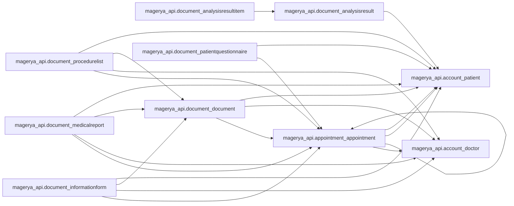

# Relation graph

Application-schema candidate relations and foreign-key edges (metadata only).

```mermaid
flowchart LR
  N0["magerya_api.account_doctor"]
  N1["magerya_api.account_patient"]
  N2["magerya_api.appointment_appointment"]
  N3["magerya_api.document_analysisresult"]
  N4["magerya_api.document_analysisresultitem"]
  N5["magerya_api.document_document"]
  N6["magerya_api.document_informationform"]
  N7["magerya_api.document_medicalreport"]
  N8["magerya_api.document_patientquestionnaire"]
  N9["magerya_api.document_procedurelist"]
  N2 --> N0
  N2 --> N2
  N2 --> N1
  N2 --> N1
  N3 --> N1
  N4 --> N3
  N5 --> N2
  N5 --> N0
  N5 --> N1
  N6 --> N2
  N6 --> N0
  N6 --> N5
  N6 --> N1
  N7 --> N2
  N7 --> N0
  N7 --> N5
  N7 --> N1
  N8 --> N2
  N8 --> N1
  N9 --> N2
  N9 --> N0
  N9 --> N5
  N9 --> N1
```
